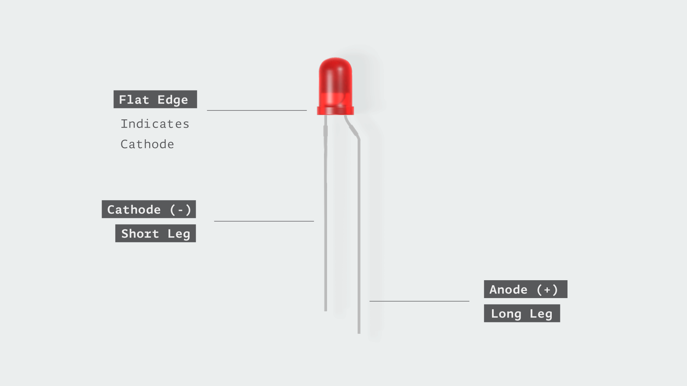

### Theory

#### Introduction
The Raspberry Pi is a versatile single-board computer widely used by engineers, hobbyists, and developers for learning and prototyping embedded systems. One of its standout features is the General Purpose Input/Output (GPIO) pins, which allow it to interface with external hardware like LEDs, sensors, and motors. This experiment introduces GPIO functionality by creating a simple circuit to blink an LED on and off every two seconds. Using a Python program, the GPIO pin toggles between HIGH (3.3V) and LOW (0V) states, demonstrating basic control and laying the groundwork for more complex projects such as IoT systems or sensor networks. The setup process also emphasizes safety, requiring the Raspberry Pi to be powered off during hardware assembly to avoid damage from electrostatic discharge (ESD) or incorrect connections.

#### Components Used in This Experiment
- Raspberry Pi (any model with GPIO pins)
- One LED (any color)
- One Resistor (330 Ω to 1 kΩ)

#### Component Descriptions

1. **Raspberry Pi**
   The Raspberry Pi is a compact, ARM-based single-board computer designed for educational and development purposes. Models such as the Raspberry Pi 3 Model B or Raspberry Pi 4 (with up to 8GB RAM) feature 40 GPIO pins, including 2x 3.3V, 2x 5V, 8x GND, and 26 programmable pins (GPIO2 to GPIO27). These pins enable interaction with external devices, with each of the 17 general-purpose pins capable of supplying up to 15mA, and a total GPIO current limit of 50mA. This makes it an ideal platform for both simple circuits and advanced applications.
   

2. **LED (Light Emitting Diode)**
   An LED is a semiconductor device that emits light when an electric current flows through it. It has two legs: the anode (longer leg, positive) and the cathode (shorter leg, negative). In this experiment, the LED blinks to visually indicate GPIO state changes. LEDs come in various colors (e.g., red, green, blue), but any color works here as the principle remains the same.
  

3. **Resistor (330 Ω to 1 kΩ)**
   A resistor limits current flow to protect the LED and GPIO pin from damage. Without it, excessive current could burn out the LED or overload the Raspberry Pi’s 15mA per-pin limit. A value between 330 Ω and 1 kΩ is chosen to balance brightness and safety, based on the LED’s forward voltage (typically 2V) and the 3.3V GPIO output.
   

#### Explanation of Each Connection

1. **GPIO Pin to LED Anode (via Resistor)**
   The LED’s anode is connected to a GPIO pin (e.g., GPIO17) through a resistor. The GPIO pin is used because it can be programmatically set to HIGH (3.3V) to supply voltage or LOW (0V) to turn off the LED. This control is the core of the blinking effect. The resistor is placed in series to limit current, 
   calculated using Ohm’s Law:
    R = (V_source - V_LED) / I, where V_source is 3.3V, V_LED is ~2V, and I is ~5-10mA, yielding a safe range of 330 Ω to 1 kΩ.

2. **LED Cathode to Ground (GND)**
   The LED’s cathode connects to a GND pin on the Raspberry Pi via the breadboard. This completes the circuit, allowing current to flow from the GPIO pin through the LED to ground when the GPIO is HIGH. The GND pin serves as the reference point (0V) for the circuit, essential for proper operation.

3. **Resistor Placement**
   The resistor is connected between the GPIO pin and the LED’s anode (though it could also be placed between the cathode and GND with the same effect). This placement ensures the current is limited before reaching the LED, protecting both the LED and the GPIO pin from overcurrent damage.

