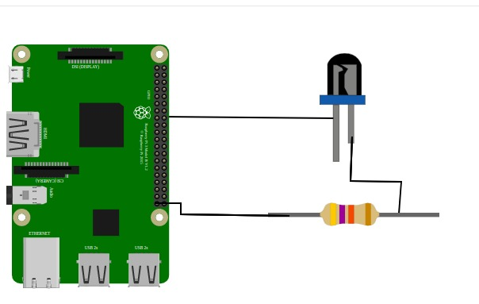

#### Hardware Setup
1. Identify the two pins of the LED:  
   - The longer pin is the positive terminal (**anode**).  
   - The shorter pin is the negative terminal (**cathode**).  
2. Connect the negative terminal (shorter pin) to the **GND** pin of the Raspberry Pi.  
3. Connect the positive terminal (longer pin) to a separate line on the breadboard.  
4. Attach one end of a resistor to the same line as the positive LED terminal.  
5. Connect the other end of the resistor to a **GPIO pin** on the Raspberry Pi (e.g., GPIO17).  

   <div></div>

#### Software Setup

##### 1. Controlling the LED with Python 3 on Raspberry Pi OS
Once the hardware is set up, the LED can be controlled using Python 3. The following process enables LED control:

- Import the `RPi.GPIO` module for GPIO access.  
- Import the `time` module for delays.  
- Define a global constant for the LED’s GPIO pin number.  
- Configure the Raspberry Pi to use **BCM** numbering (GPIO numbers).  
- Set up the GPIO pin as an output using `GPIO.setup()`.  

##### 2. Making the LED Blink
- Maintain the same GPIO configuration.  
- Implement an infinite loop that toggles the LED on and off at set intervals.  
- The LED remains **ON** for 1 second and **OFF** for 2 seconds.  
- The loop runs indefinitely until manually stopped using the stop button in the Thonny IDE or `CTRL+C` in the terminal.  


#### Booting the Raspberry Pi OS
Before setting up the LED, ensure your Raspberry Pi is ready with a working operating system.

1. **Prepare the microSD Card**  
   - Download the [Raspberry Pi Imager](https://www.raspberrypi.com/software/) on your computer.  
   - Insert a microSD card (8 GB or larger).  
   - In Raspberry Pi Imager, select the desired OS (e.g., Raspberry Pi OS 32-bit), choose your microSD card, and click **Write**.  

2. **Insert the microSD Card**  
   - Safely eject it from your computer and insert it into the Raspberry Pi’s microSD slot.  

3. **Connect Peripherals**  
   - Attach a monitor via HDMI.  
   - Connect a USB keyboard and mouse.  
   - Optionally, connect Ethernet (Wi-Fi can be set up later).  

4. **Power On**  
   - Connect the Raspberry Pi to its power supply.  
   - The system will boot into Raspberry Pi OS setup automatically.  

5. **First-Time Setup**  
   - Follow the on-screen prompts to set your language, keyboard layout, Wi-Fi, and software updates.  

Once the OS is up and running, proceed to the hardware setup.


#### Python Code Implementation

```python
import RPi.GPIO as GPIO
import time

# Define the GPIO pin number for the LED
LED_PIN = 17

# Set the GPIO mode to BCM (Broadcom pin-numbering scheme)
GPIO.setmode(GPIO.BCM)

# Set up the LED pin as an output
GPIO.setup(LED_PIN, GPIO.OUT)

try:
    while True:
        # Turn the LED on (HIGH state)
        GPIO.output(LED_PIN, GPIO.HIGH)
        time.sleep(1)  # Wait for 1 second

        # Turn the LED off (LOW state)
        GPIO.output(LED_PIN, GPIO.LOW)
        time.sleep(2)  # Wait for 2 seconds

except KeyboardInterrupt:
    # Clean up GPIO settings when exiting the program
    GPIO.cleanup()
